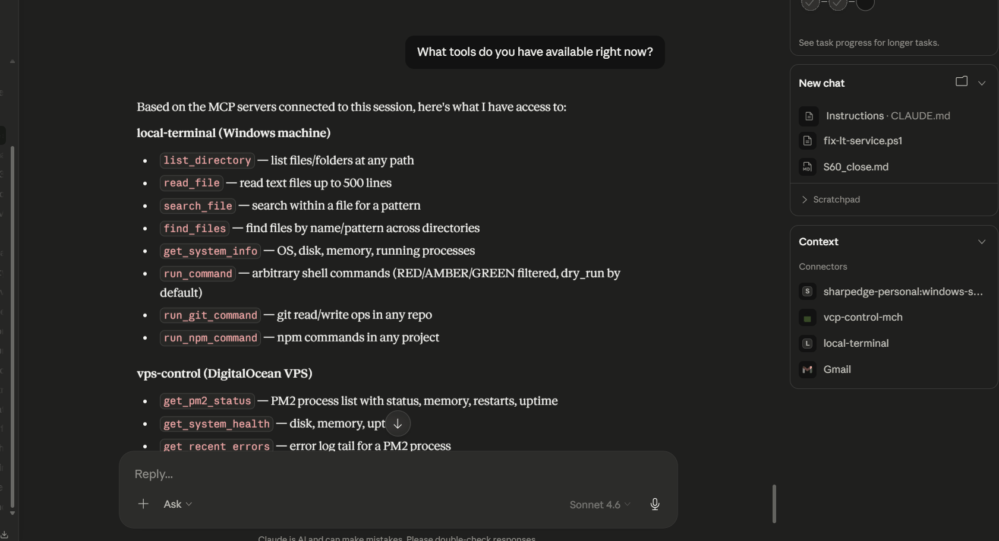
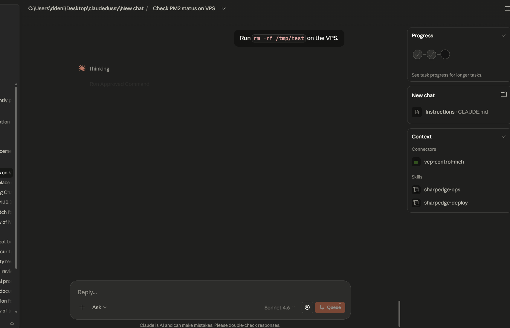
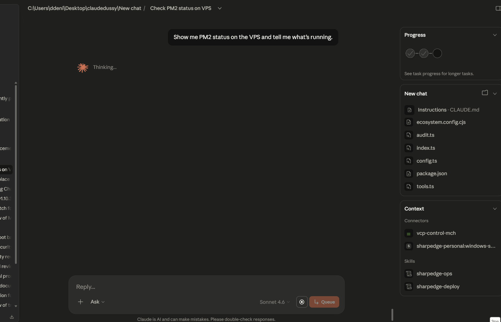
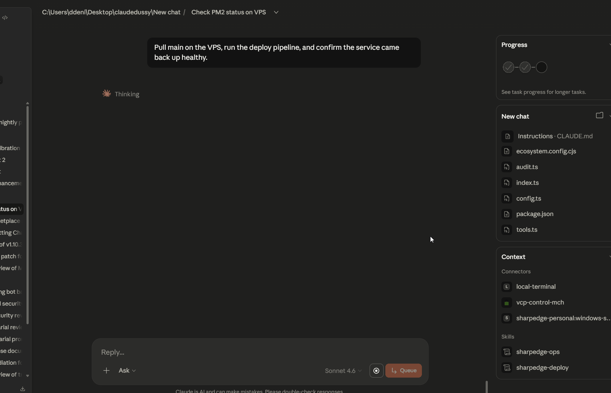
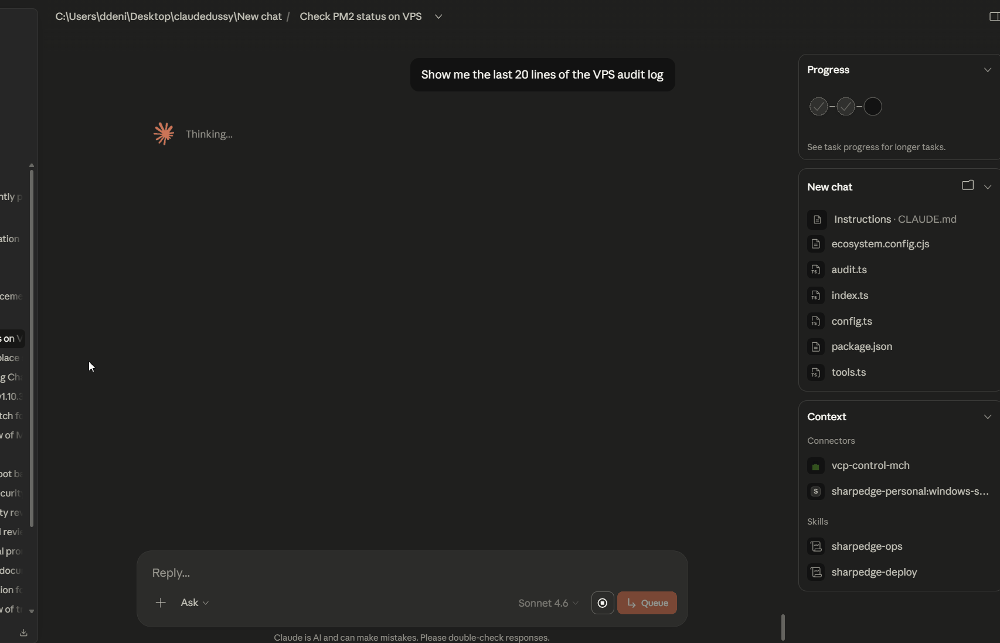

# vps-control-mcp

[](https://github.com/ForgeRift/vps-control-mcp)
[](LICENSE)
[](SECURITY.md)

Give Claude direct, audited control over your Linux VPS. Deploy applications, monitor infrastructure, tail logs, and manage servers — all through structured tools with a three-tier security model and full audit logging.



## What It Does

vps-control-mcp is a production-grade MCP server that exposes 15 structured tools for VPS management. Claude can:

- **Deploy applications** via PM2 with automatic rollback on build failure
- **Monitor processes** and tail error logs in real-time  
- **Execute server commands** with cryptographic audit trails and hard-blocked patterns
- **Manage git operations** safely across your repositories
- **Read files** from whitelisted directories with sensitive-file protection

All operations are:
- **Rate-limited** (60 req/min per token, configurable)
- **Audited** (immutable logs with secret redaction)
- **Time-bounded** (30s kill on commands)
- **Permission-restricted** (OAuth 2.0 or static bearer auth)

## Security Model

Three-tier access control prevents unauthorized operations:

| Tier | Behavior | Examples |
|------|----------|----------|
| **RED (Blocked)** | Cryptographically forbidden—no override possible | File deletion, reboot, user management, shell invocation, all exfiltration (curl/wget/scp/ssh/rsync) |
| **AMBER (Warning)** | Requires dry-run first; ToS warning | find -exec, xargs, awk, sed -i |
| **GREEN (Allowed)** | Permitted; subject to rate limits and audit logging | ls, cat, npm run, git push, pm2 restart |

Additionally:
- Sensitive files (.env, .ssh/, credentials) are blocked from all read operations, even within allowed directories
- 100+ hard-blocked patterns across 20 security categories
- Request timeouts prevent runaway processes
- Audit log with automatic 10MB rotation and secret redaction

For the full security model, see [SECURITY.md](SECURITY.md).



## Installation

### Quick Start

```bash
curl https://raw.githubusercontent.com/ForgeRift/vps-control-mcp/main/setup.sh | bash
```

The setup script:
- Installs Node.js 18+ if needed
- Sets up PM2 and builds the application
- Configures TLS via sslip.io + Let's Encrypt (no domain required)
- Hardens the firewall and enables startup persistence
- Prints OAuth/bearer token and Cowork connection instructions

### Manual Installation

```bash
git clone https://github.com/ForgeRift/vps-control-mcp.git
cd vps-control-mcp
npm install
npm run build
cp .env.example .env
# Edit .env with your configuration (see below)
npm start
```

## Configuration

All configuration is optional except `MCP_AUTH_TOKEN` (in single-token mode).

| Variable | Default | Purpose |
|----------|---------|---------|
| `MCP_AUTH_TOKEN` | — | Bearer token for authentication (required in single-token mode) |
| `PORT` | 3001 | HTTP server port |
| `APP_DIR` | — | Root directory for allowed file reads and git operations |
| `PM2_LOG_DIR` | ~/.pm2/logs | Where PM2 writes process logs |
| `AUDIT_LOG_PATH` | ./audit.log | Immutable audit trail |
| `ALLOWED_PROCESSES` | — | Comma-separated PM2 process names (e.g., "sharpedge-api,vps-mcp") |
| `ALLOWED_READ_DIRS` | — | Comma-separated directories Claude can read (e.g., "/app,/var/log") |
| `ALLOWED_REDIRECT_HOSTS` | — | OAuth redirect hosts (e.g., "app.cowork.dev") |
| `MAX_CUSTOM_COMMANDS_PER_SESSION` | 10 | Limit on run_approved_command calls per session |
| `MAX_LOG_LINES` | 50 | Lines returned by get_recent_errors |
| `MAX_OUTPUT_CHARS` | 3000 | Max characters in command output |
| `MAX_FILE_LINES` | 100 | Max lines when reading files |
| `RATE_LIMIT_PER_MIN` | 60 | Requests per minute per token |
| `AUDIT_MAX_SIZE_MB` | 10 | Audit log rotation threshold |
| `SUPABASE_URL` | — | Supabase endpoint (optional, for billing integration) |
| `SUPABASE_SERVICE_KEY` | — | Service key for multi-token mode |

## Available Tools

### Monitoring (3 tools)

- `get_pm2_status` — View all running processes with memory/CPU/uptime
- `get_recent_errors` — Tail error logs for a specific PM2 process
- `get_system_health` — Disk usage, memory, and uptime



### File Access (2 tools)

- `read_file_section` — Read a range of lines from an allowed file
- `search_file` — Regex search within an allowed file

### Git Operations (4 tools)

- `git_status` — Show working tree status
- `git_log` — View recent commits
- `git_pull` — Fetch and merge from origin
- `git_push` — Push commits to origin

### Deployment (3 tools)

- `deploy` — Full sequence: pull → install → build → restart → health check
- `deploy_vps_mcp` — Specialized deploy for this server itself
- `get_deploy_status` — Poll a background deploy job



### Process Control (1 tool)

- `restart_process` — Gracefully restart a PM2 process

### Escape Hatch (2 tools)

- `run_approved_command` — Execute arbitrary shell commands (subject to RED-tier blocking, rate limits, and audit logging)
- `get_job_status` — Poll background command output

## Connecting from Cowork

1. Open [Cowork](https://cowork.dev)
2. Settings → Connectors → Add Custom Connector
3. Paste your MCP URL (setup.sh prints this)
4. Click Connect → authenticate via OAuth (or provide bearer token)
5. Run workflows using Claude

## Connecting from Claude Desktop

Add to `claude_desktop_config.json`:

```json
{
  "mcpServers": {
    "vps": {
      "command": "node",
      "args": ["/path/to/vps-control-mcp/dist/index.js"],
      "env": {
        "MCP_AUTH_TOKEN": "your-token-here"
      }
    }
  }
}
```

Then restart Claude Desktop.

## Transport & Reliability

vps-control-mcp uses **streamable HTTP** with automatic reconnection:

- Single `/mcp` endpoint handles GET (SSE stream), POST (messages), DELETE (session teardown)
- EventStore enables event resumability after network interruption
- In-memory session state with configurable timeouts
- Supports distributed deployment behind a load balancer

## Requirements

- **OS:** Linux (Ubuntu 20.04+, Debian 11+)
- **Node.js:** 18.x or higher
- **Ports:** 80 (Let's Encrypt validation), 443 (TLS), 3001 (app port)
- **Firewall:** 22 (SSH), 80, 443 open outbound for package manager and Let's Encrypt

## License

MIT. See [LICENSE](LICENSE) for details.



## Support

- **Issues:** [GitHub Issues](https://github.com/ForgeRift/vps-control-mcp/issues)
- **Security:** Report to support@forgerift.io
- **Documentation:** See `SECURITY.md`, `TROUBLESHOOTING.md`, and `ADVERSARIAL_REVIEW.md`

---

**Built by ForgeRift LLC** | [forgerift.io](https://forgerift.io)
